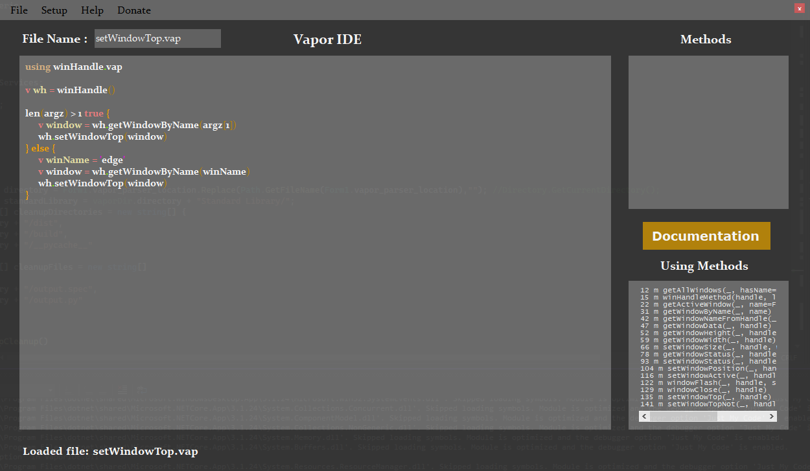

# Vapor-IDE
### The official IDE for writing code in my programming language, [Vapor](https://github.com/mwd1993/Vapor)

You can build the project yourself, or download the executable from Releases.  
Currently, the code is not well documented (will change soon).

The Example above, utilizes a standard library (written in Vapor), to make a window/app, stay on top of all other windows and uses cmd line logic (potentially)
